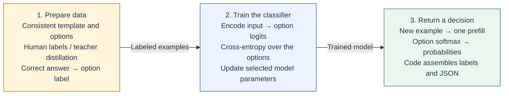

# Jev-PolicyLite

**A lightweight multimodal decision model for content moderation**

[中文](README.md) | [English](README.en.md)

[Model](models/pilot-multihead-v0.1) · [Four-photo heads](models/pilot-multi-photo-v0.1) · [Training](docs/TRAINING_GUIDE.md) · [Experiments](docs/EXPERIMENTS.md) · [Project page source](site/) · [MIT](LICENSE)

Jev-PolicyLite is a lightweight multimodal decision project for content moderation. Built on Qwen3.5-0.8B, it reads an image, accompanying text, and moderation rules together, then predicts a violation score, visual attributes, and a handling action in one forward pass. Inspired by Jev / NanoJev's direct-scoring approach, it provides multi-head training, review-feedback processing, and policy-head preference optimization.

## Core approach: define a finite set of decisions

**Define the choices the model must make, then train their scores.** For tasks with a known label set, examples can be framed as multiple-choice questions under a consistent prompt template. Human annotations or teacher-model distillation provide supervision. After encoding the input once, the model returns option probabilities, which application code turns into a structured result.



The diagram describes the fixed-option approach. **Jev-PolicyLite applies it to moderation: one shared multimodal encoding feeds separate violation, attribute, and action heads.** Violation and co-occurring attributes use sigmoid outputs; mutually exclusive actions use softmax. Application code assembles the result, so JSON does not need to be generated token by token. Each head reads the hidden representation through its own `LayerNorm + Linear` layer.

When handling criteria change, review corrections can be converted into action preferences. With the backbone and LoRA frozen, their features can be cached and reused while discrete DPO updates only the policy head. Content recognition and action adjustment become separate training stages whose costs and benefits can be measured independently.

<details>
<summary>Fixed-option implementation: labels, loss, and the readout position</summary>

1. **Label mapping.** When options use vocabulary tokens, verify that each option corresponds to one distinct token in the actual prompt context, and store the option-index-to-token-ID mapping. The cross-entropy target is an index within the candidate set. A multi-token option cannot be scored from just one of its tokens.
2. **Training objective.** Let `z` be the vocabulary logits at the answer-prediction position and `S` the candidate token IDs. Compute `p = softmax(z[S])` and the loss `-log p[y]` for the correct option. Normalization is over the candidates. Masking prompt positions in a language-model loss still normalizes over the full vocabulary, which is a different objective.
3. **Readout position.** Inference reads the hidden state or next-token logits at the last valid **input** token. These are available when prefill finishes; answer labels are used only for supervision. No answer needs to be generated before the readout. The full multimodal encoding still has to run.

The supervised experiments in this repository use content-severity annotations and derived labels; they do not report teacher-model distillation. The training code uses BCE / cross-entropy on task heads. This diagram summarizes a modeling approach, not a full reproduction of Jev. A single forward pass avoids subsequent text generation, but does not establish a speed advantage over dedicated vision classifiers; measured comparisons appear below.

</details>

The pilot focuses on sexual-content severity labels, so its results do not establish effectiveness across all sensitive-content categories. Benefits from real human feedback still need separate evaluation.

## What is included

- **Multi-head moderation:** Qwen3.5's multimodal backbone with task LoRA and separate violation, attribute, and action heads.
- **Policy-head post-training:** tools that convert review corrections into action preferences and run discrete DPO on cached frozen features.
- **Training and evaluation tools:** data validation, image-group splits, threshold calibration, head-level evaluation, and per-image localization and latency tests for four photos in one input.
- **Model and local service:** a pilot LoRA adapter, three moderation heads, and a FastAPI web interface with resource monitoring.

The repository records training, DPO, and local-deployment trials. The results below come from those experiment notes; they are not a production evaluation.

## Method

### Image, text, and policy input

<p align="center">
  
</p>

The model reads the last valid token's hidden representation and passes it to three `LayerNorm + Linear` heads:

| Head | Output | Purpose |
| --- | --- | --- |
| Violation | Sigmoid score | Predict whether content violates the supplied policy |
| Attribute | Independent sigmoid scores | Predict co-occurring attributes: `nudity`, `sexual_act`, `suggestive`, `medical` |
| Policy | Three-way softmax | Predict `block`, `review`, or `allow` |

Supervised adaptation warms up the task heads, then trains language LoRA and the heads while keeping the visual encoder frozen. Attributes and handling actions are modeled separately: nudity and a medical context may coexist, while the policy head learns the handling action.

Jev / NanoJev inspired the direct-scoring and decision-interface design. This implementation uses shared representations for fixed moderation labels and adds policy-head DPO. It does not implement dynamic candidate-set attention or reproduce the full Jev system.

### Policy-head preference optimization

A review record pairs the reviewer's preferred action, `chosen`, with the model's original action being corrected, `rejected`, under the same image, text, and policy.

The backbone, LoRA, violation head, and attribute head are frozen. Multimodal features are extracted once. The trainable policy head and frozen reference head read the same features, and discrete DPO updates the action probabilities. The reference requires only a copy of the small policy head.

<p align="center">
  
</p>

Feature reuse reduces repeated encoding. This is useful when existing features distinguish the relevant evidence but the action needs adjustment. Updating the head cannot recover visual details absent from those features. The implementation optimizes discrete action preferences; it does not include online rollouts, PPO, or GRPO.

## Results

### DPO workflow validation on an RTX 3090

Binary labels were used to construct 128 block/allow preference pairs, split by image group into 103 training and 25 validation pairs. Training ran for two epochs.

| Validation metric | Before | After |
| --- | ---: | ---: |
| DPO loss | 0.6931 | 0.4371 |
| Preference ranking accuracy | 100.0% | 100.0% |
| Mean chosen/rejected log-probability margin | 6.7104 | 7.9800 |
| KL to the reference policy | 0 | 0.00119 |

Feature extraction for 128 records took **46.23 s**. Two policy-head epochs and evaluation took **0.19 s**. Peak CUDA allocation was **2.00 GiB**. Timings exclude model loading and saving; the 0.19 s figure also excludes feature extraction. The script includes the final training/validation evaluation in this interval.

These preferences repeat existing binary labels, and all validation pairs were ranked correctly before training. The run establishes that the workflow operates, not a benefit from real human feedback or a validated review action. See the [DPO experiment record](docs/DPO_SMOKE_RESULT_V1.md).

### Mosaic and edge experiments

| Experiment | Measured result | Interpretation |
| --- | --- | --- |
| 200 mosaics, 2×2 layout | 89.5% accuracy, 90.7% recall, 14.0% FPR | A mosaic is positive if any tile is positive; this does not evaluate tile localization |
| Mosaics with one violating tile | 84.0% accuracy | Tests small-target and multi-image interference |
| Linux x86_64, single-head Q4, four CPU threads | About 479 MB model directory; about 859 MiB peak RSS | Decisions matched on 8 sampled cases; full regression is pending |

Details: [mosaic results](docs/MOSAIC_2X2_RESULT_V1.md) and [edge status](docs/EDGE_STATUS.md). Mobile devices, quantized multi-head inference, and Windows deployment have not yet been measured.

### Per-image decisions from four photos in one input

With the backbone and LoRA frozen, four small position heads score the corresponding images in one prefill. The local-readout variant takes a hidden state at the end of each image's visual segment; its four heads contain 12,292 parameters in total. On an RTX 3090, the same **200 groups of four photos (800 per-image labels)** produced these results. Mean latency includes image loading, preprocessing, and inference, but excludes model loading and network transport.

<!-- BEGIN MULTI_PHOTO_TABLE -->

| Method | Per-image accuracy | F1 | Recall | All four correct | Mean/group | P95/group |
| --- | ---: | ---: | ---: | ---: | ---: | ---: |
| Serial x4 | 90.12% | 88.67% | 88.29% | 65.0% | 537.47 ms | 544.34 ms |
| Batch=4 | 89.75% | 88.22% | 87.71% | 64.0% | 163.79 ms | 169.85 ms |
| Global heads | 84.88% | 82.18% | 79.71% | 55.0% | 153.08 ms | 157.76 ms |
| Local heads | 87.50% | 85.34% | 83.14% | 60.0% | 154.64 ms | 157.47 ms |
| Shared local head | 87.12% | 84.70% | 81.43% | 58.5% | 153.97 ms | 157.48 ms |
| Online mosaic | 80.75% | 78.90% | 82.29% | 50.0% | 182.59 ms | 195.44 ms |

<!-- END MULTI_PHOTO_TABLE -->

The one-input approach is about 3.47× faster than serial calls, but only 5.6% faster than batch=4 while losing 2.25 accuracy points. It is not an accuracy-preserving speedup; batch=4 remains preferable when per-image correctness matters more than a few milliseconds. Labels come from the original images, not a fresh human review of each group. See the [full experiment](docs/MULTI_PHOTO_RESULT_V1.md) for P50/P95, other readouts, and limitations.

The audit found **426 unique source images** behind these 800 tile labels, with no source-image overlap across train, validation, and test. Local readouts can include preceding images through the causal prefix. New mosaic IDs include the split to prevent collisions when manifests are merged; the original evaluation read each split separately.


### Comparison with public NSFW systems

On 2026-09-26, three public systems and two Jev resolution settings were evaluated sequentially on the same RTX 3090. The test set contains **600 unique images × two policies = 1,200 decisions**. Per-policy thresholds maximize F1 on a separate calibration set of 300 images. Accuracy at 0.5 is reported alongside calibrated metrics.

<!-- BEGIN NSFW_QUALITY_TABLE -->

| Model | Acc @0.5 | Acc calibrated | F1 | Recall | FPR | Accuracy 95% CI |
| --- | ---: | ---: | ---: | ---: | ---: | --- |
| Falconsai ViT | 80.33% | 83.33% | 86.60% | 86.13% | 21.33% | 81.17%–85.42% |
| Giacomo ViT (5-class) | 74.92% | 76.42% | 82.46% | 88.67% | 44.00% | 74.00%–79.00% |
| NudeNet 320n | 75.83% | 80.17% | 85.58% | 94.13% | 43.11% | 78.00%–82.17% |
| Jev-PolicyLite 50k | 90.75% | 91.00% | 92.92% | 94.53% | 14.89% | 89.25%–92.58% |
| Jev-PolicyLite 201k | 94.08% | 93.50% | 94.72% | 93.33% | 6.22% | 91.83%–95.00% |

<!-- END NSFW_QUALITY_TABLE -->

Latency uses the same 120 unique images, a full pass over every timed input for warmup, and three repetitions with interleaved model order. It includes image loading, preprocessing, forward inference, all output heads or box postprocessing, and CPU results; model loading, networking, and queueing are excluded. B=4 latency is the time to complete the **entire four-image batch**. Memory is measured separately in one-model processes.

<!-- BEGIN NSFW_SPEED_TABLE -->

| Model | B=1 mean / P95 (ms) | B=4 mean / P95 (ms) | B=4 images/s | Peak RSS (MiB) | Torch allocated (MiB) |
| --- | ---: | ---: | ---: | ---: | ---: |
| Falconsai ViT | 21.50 / 24.36 | 54.21 / 57.46 | 73.8 | 1131 | 539 |
| Giacomo ViT (5-class) | 20.58 / 22.69 | 48.17 / 51.46 | 83.0 | 1144 | 539 |
| NudeNet 320n | 27.05 / 33.03 | 88.80 / 105.77 | 45.0 | 1170 | N/A (ONNX) |
| Jev-PolicyLite 50k | 164.96 / 167.33 | 198.02 / 201.80 | 20.2 | 2703 | 1749 |
| Jev-PolicyLite 201k | 169.95 / 172.36 | 211.72 / 225.72 | 18.9 | 2705 | 2012 |

<!-- END NSFW_SPEED_TABLE -->

50k / 201k denote image-area limits of 50,176 / 200,704 pixels, preserving aspect ratio. Both ViTs use 224×224 inputs; NudeNet uses 320×320. RSS is peak CPU process memory. Torch allocated memory excludes other GPU allocations and does not measure the ONNX model.

On this in-domain two-policy benchmark, Jev has higher decision quality while specialized vision systems are faster. The 201k configuration reaches **93.50%** calibrated accuracy at **211.72 ms per four-image batch**; Falconsai reaches **83.33% / 54.21 ms**. Reducing Jev's image-area limit to 50k saves only **6.5%** of batch latency and loses **2.5 accuracy points**. Lower resolution alone offers limited benefit in this implementation. The project's focus remains joint image/text/policy decisions and lightweight policy-head post-training; these results do not support a speed advantage over specialized visual NSFW classifiers.


| System | Native classification granularity | Boxes | Policy adaptation |
| --- | --- | --- | --- |
| [Falconsai](https://huggingface.co/Falconsai/nsfw_image_detection) | normal / nsfw, 2 classes | No | Threshold selection in application code |
| [Giacomo ViT](https://huggingface.co/giacomoarienti/nsfw-classifier) | drawings / hentai / neutral / porn / sexy, 5 classes | No | Class selection and thresholds |
| [NudeNet 320n](https://github.com/notAI-tech/NudeNet) | 18 body-part / coverage labels, including non-violating faces and feet | Yes | Box classes and thresholds |
| Jev-PolicyLite | Binary violation, 4 attribute scores, 3 action scores | No | Encodes natural-language policy; only two seen policies evaluated |

Output count is not evidence of classification quality. Our attribute diagnostics use level-derived proxy labels for nudity, sexual acts, and suggestiveness; medical has no positive examples, and review lacks independent annotations. The dataset also lacks native five-class labels and box annotations, so five-class accuracy and detection mAP cannot be measured. Jev was trained on the source training split; external models retain their public weights. This is a task-adaptation comparison, not a controlled architecture ablation.

On those proxy labels, the higher-resolution Jev model achieves **93.55% / 89.90% / 82.74% F1** for nudity, sexual acts, and suggestiveness. NudeNet's F1-selected threshold for the suggestive policy collapses to zero and flags every image; its pooled recall obscures this failure. The following figure separates correctness by policy and source level.


Qwen currently uses the reference PyTorch `causal_conv1d` path; optimized kernels were not benchmarked. All latency measurements were repeated after the other training job on the shared host ended. These are not mobile or CPU results. See the [full protocol and audit](docs/NSFW_COMPARISON_V1.md) for per-policy metrics, low-FPR operating points, attribute diagnostics, and reproduction commands. [Raw predictions and timings](docs/results/nsfw-comparison-v1/), [PNG / SVG / PDF figures](docs/figures/), and the [plotting script](scripts/report_nsfw_benchmark.py) are included.

## Getting started

Requirements: Python 3.10+, Git LFS, and Transformers 5.x. GPU training requires a compatible CUDA build of PyTorch. Commands below use Bash.

```bash
git lfs install
git clone https://github.com/fffffiii/jev-policylite.git
cd jev-policylite
git lfs pull

python -m venv .venv
source .venv/bin/activate
pip install -e '.[dev,web]'
```

### Load the pilot model

The [model directory](models/pilot-multihead-v0.1) contains approximately 43 MB of LoRA weights, three moderation heads, calibration, and metadata. Download the Qwen base model separately. The adapter package also omits the processor; save the base processor into the checkpoint directory before first use:

```bash
python -c "from transformers import AutoProcessor; AutoProcessor.from_pretrained('Qwen/Qwen3.5-0.8B').save_pretrained('models/pilot-multihead-v0.1/processor')"
```

The base model's first load requires network access or an existing local cache. Offline loading requires the base model, adapter, and processor to be available locally.

```bash
python scripts/predict.py \
  --checkpoint models/pilot-multihead-v0.1 \
  --image path/to/image.jpg \
  --text "image caption" \
  --policy-id strict-v1 \
  --policy-file policies/strict.txt
```

This command returns the binary violation result, not the attribute or policy-head outputs. See the [training guide](docs/TRAINING_GUIDE.md) and [model card](models/pilot-multihead-v0.1/README.md) for multi-head outputs and service usage.

### Supervised training

Prepare a JSONL manifest using the [data schema](data/README.md), then configure paths and training parameters in `configs/train.yaml`:

```bash
python scripts/validate_data.py --manifest data/manifest.jsonl --image-root .
python scripts/train.py --config configs/train.yaml
```

For multi-head settings, see `configs/public-pilot-multihead.yaml`. Attribute and policy heads require their corresponding labels; mapping binary labels to block/allow does not teach review. Full instructions are in the [training guide](docs/TRAINING_GUIDE.md).

### Update the policy from review feedback

After preparing the model above, place review records in `data/review_feedback.jsonl`:

```bash
python scripts/build_preference_pairs.py \
  --feedback data/review_feedback.jsonl \
  --output outputs/preferences/review_pairs.jsonl \
  --strict

python scripts/train_policy_dpo.py \
  --checkpoint models/pilot-multihead-v0.1 \
  --preferences outputs/preferences/review_pairs.jsonl \
  --output-dir outputs/policy-dpo \
  --epochs 3 --beta 0.5
```

Provide a `group_id` shared by every version of an image and its near duplicates. Without it, the converter groups by image path only; it cannot identify near duplicates. The trainer splits training and validation data by group and refuses to overwrite an existing output directory. It saves the adapter, processor, task heads, and `dpo_metrics.json`; loading still requires the base model. See the [post-training guide](docs/HUMAN_FEEDBACK_AND_RL.md) for the preference schema and parameters.

### Local service

```bash
MODEL_CHECKPOINT=models/pilot-multihead-v0.1 \
CALIBRATION_FILE=models/pilot-multihead-v0.1/calibration.json \
python -m uvicorn qwen35_moderation.web.app:app \
  --host 127.0.0.1 --port 8089 --workers 1
```

Open `http://localhost:8089` to submit images and text and inspect results and runtime status. The main verdict comes from the binary violation head; separate cards show attribute scores and policy-head suggestions.

Offline metrics are optional. Set `TEST_METRICS_FILE` to the matching `test_metrics.json`; otherwise the page shows that no metrics were supplied. Images are written to a temporary directory during preprocessing and deleted afterward; the service does not keep an image or text history. There is no login or authentication layer. The example binds to localhost; configure access controls before exposing it to a network.

## Limitations

- Pilot attribute labels are derived from source content categories. Dedicated medical-context and review labels are insufficient, so reliability for these categories has not been established.
- Policy text is supported as input. Removed-policy, replaced-policy, and unseen-policy tests are still needed to establish whether the model uses policy semantics.
- Small development experiments cannot establish low false-positive guarantees. Independent evaluation should report recall at a stated FPR and results by content type.
- Task-level comparisons with three public vision-based NSFW systems are included. Same-backbone Yes/No scoring and matched-training-data ablations are still pending, so quality differences cannot be attributed to the decision heads alone.

## Documentation and contributions

| Topic | Documentation |
| --- | --- |
| Data schema and annotation | [Data guide](data/README.md) |
| Supervised training, calibration, evaluation | [Training guide](docs/TRAINING_GUIDE.md) |
| Review feedback and discrete DPO | [Post-training guide](docs/HUMAN_FEEDBACK_AND_RL.md) |
| Multi-head and mosaic stress tests | [Experiment tools](docs/EXPERIMENTS.md) |
| Static project-page deployment | [GitHub Pages](docs/GITHUB_PAGES.md) |

Supporting guides include Chinese-language documentation. Contributions, reproduction reports, and error analyses are welcome. Run `python -m pytest -q` before submitting changes. Moderation changes should state the policies, labels, and data splits used; see [contribution guidelines](CONTRIBUTING.md). Real moderation images, review feedback, and private logs are excluded from the repository.

## License and acknowledgments

Project code is released under [MIT](LICENSE). Base models, datasets, and third-party dependencies retain their own licenses.

We thank Qwen for the multimodal backbone and Jev / NanoJev for the direct-decision design inspiration. Jev-PolicyLite is an independent project.
