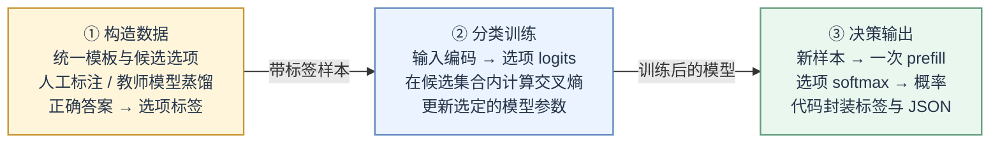
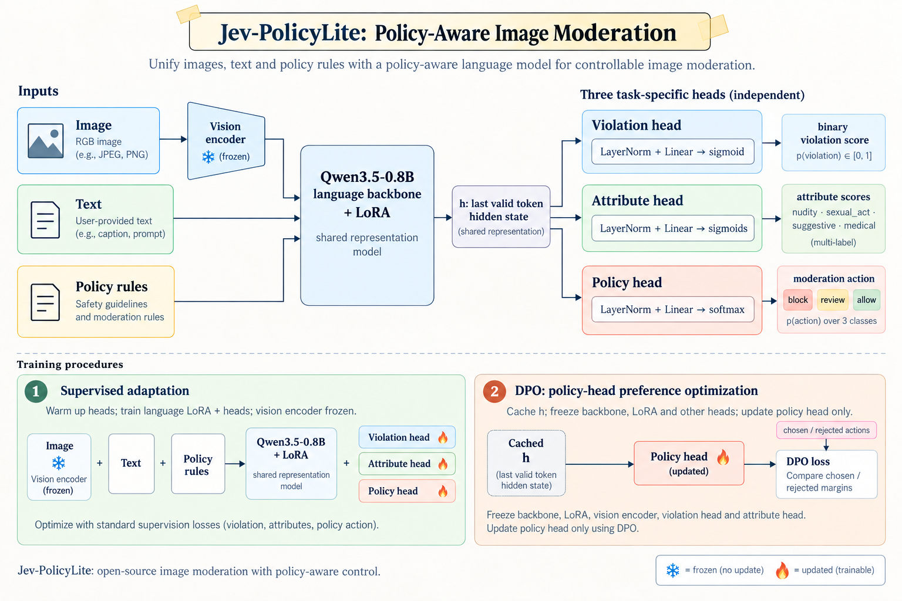
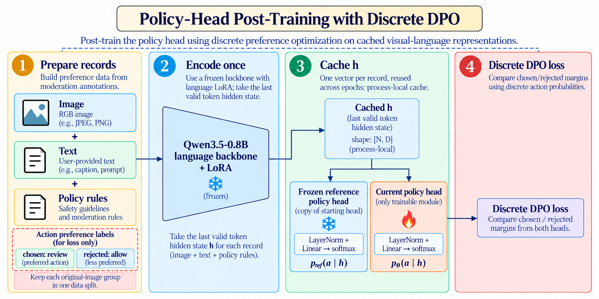
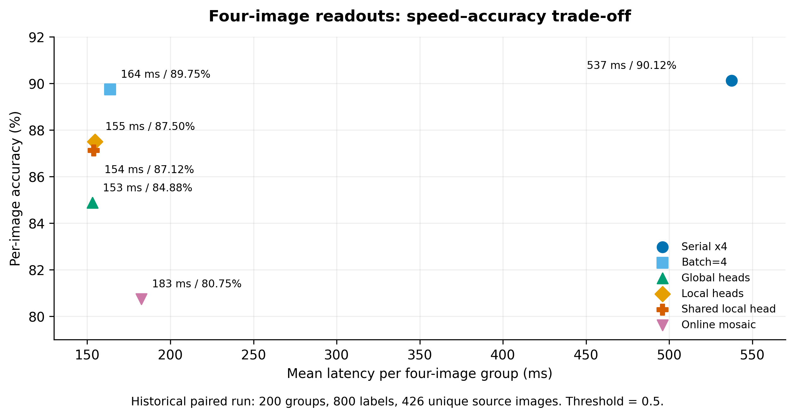
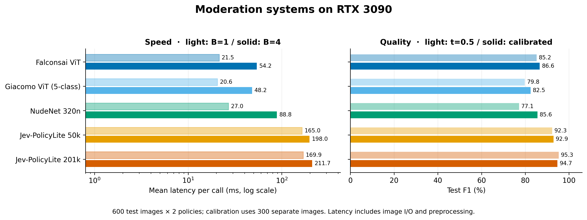
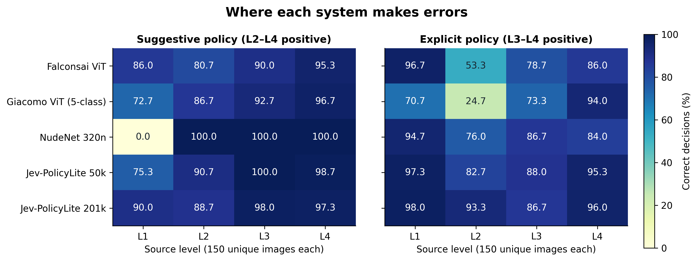

# Jev-PolicyLite

**图文和规则仅需一次编码，就能直接输出审核决策；处置策略靠后训练一个小策略头来调整。**

[中文](README.md) | [English](README.en.md)

[模型](models/pilot-multihead-v0.1) · [四图检测头](models/pilot-multi-photo-v0.1) · [训练指南](docs/TRAINING_GUIDE.md) · [实验记录](docs/EXPERIMENTS.md) · [项目页面](https://fffffiii.github.io/jev-policylite/) · [页面源码](site/) · [MIT](LICENSE)

Jev-PolicyLite 是一个内容审核方向的轻量多模态实验项目，基座是 Qwen3.5-0.8B。模型同时读图片、正文和审核规则，一次前向算出违规分数、几个视觉属性分数和处置动作。思路借自 Jev / NanoJev 的直接评分：不让模型逐 token 生成 JSON，而是直接输出各选项的概率，再由代码整理成结构化结果。仓库里包含多头训练、人工复核记录转换和策略头偏好优化的工具。

## 思路：把任务做成有限选项的选择题

标签集合固定的任务，可以把样本套进统一模板做成选择题，标签来自人工标注或教师模型蒸馏。模型编码完输入，直接给出每个选项的概率，业务代码负责把结果整理成结构化输出。



上图是固定选项路线的概括。放到审核任务里，一次图文编码共享给三个任务头：违规、属性、处置。违规头和可共存的属性头用 sigmoid，互斥的处置动作用 softmax。三个头都是从隐藏表征接一个独立的 `LayerNorm + Linear`，结果由代码封装，不用生成 JSON。

### 为什么这种结构接后训练比较省事

模型输出的是动作概率，人工反馈纠正的也是动作，两者在同一个空间里，所以接监督纠偏、偏好优化都比较直接。以审核为例，输入是图片、正文和规则，输出是 `block / review / allow` 的概率分布，复核员的纠正同样落在这三个动作上。

| 结构特点 | 为什么适合后训练 |
| --- | --- |
| 反馈直接落在动作上 | 把“放行”纠正成“复审”，就是同一输入下 `chosen=review`、`rejected=allow` 的一个偏好对，标注对象和模型输出一一对应。 |
| 模型直接给动作分布 | 偏好目标可以直接用动作的对数概率，抬高认可动作、压低被否定动作；动作集合有限，算相对参考策略的 KL 也方便。 |
| 不用生成长文本 | 离散 DPO 里一次编码就能同时拿到 chosen 和 rejected 的概率，不用为它们生成回答，也不用解析生成结果。 |

在这个基础上本项目再省一步：需要调整处置尺度时，冻结主干和 LoRA，每条图文只编码一次、把表征缓存下来，之后的训练轮次只跑小策略头，参考策略也只是复制一个头。人工纠偏就可以按“复核记录 → 动作偏好 → 策略头更新 → 独立评估”反复迭代。

计算上的节省来自两块：直接决策让反馈容易进训练；冻结表征、只训任务头让训练便宜。后者是本仓库采用的方案，也适用于其他动作集合有限的模型。如果要更新主干或 LoRA，缓存的特征就得重新算。另外，模型能输出概率不代表概率已经校准，偏好排序、误报和召回还是要分开验证。

Jev 官方把面向校准决策的强化学习方法称为 [RLCD](https://typesafe.ai/blog/introducing-system-one-models-and-jev)。本仓库实现的是审核动作上的[离散 DPO](https://arxiv.org/abs/2305.18290)，工具在 [scripts/train_policy_dpo.py](scripts/train_policy_dpo.py)，不是官方 RLCD 的复现。目前实验只验证了“缓存特征 + 策略头更新”这条流程能跑通，真实人工反馈能带来多少质量收益还没有验证。

<details>
<summary>固定选项路线的实现要点：标签、损失与读出位置</summary>

1. **标签映射。** 如果用词表里的选项 token，要确认每个选项在实际提示上下文中对应单个、互不相同的 token，并保存“选项索引 ↔ token ID”映射。交叉熵的目标是候选集合内的类别索引；多 token 选项不能只取其中一个 token 的分数。
2. **训练目标。** 设答案预测位置的词表 logits 为 `z`，候选 token ID 集合为 `S`，则 `p = softmax(z[S])`，损失为正确选项的 `-log p[y]`。注意这是在候选集合内归一化；只屏蔽 prompt 位置的语言模型损失、仍在整个词表上归一化，是另一个不同的目标。
3. **读出位置。** 推理读的是最后一个有效**输入** token 对应的隐藏表征或下一 token logits，这个位置在 prefill 完成时就已经可用；答案标签只用于监督，不用先生成答案再取它的末尾 token。完整的图文编码仍然要跑。

现有监督实验用的是内容等级标注及其映射，没有做教师模型蒸馏；训练代码在任务头上用 BCE / 交叉熵。上面的图只是范式概括，不构成 Jev 的完整复现。一次前向省掉了后续文本生成，但不等于比专用视觉分类器快，下面有实测对照。

</details>

目前试验数据主要针对性暗示、裸露和色情分级，不代表对各类敏感内容都有效。

## 项目内容

- **多头审核模型**：保留 Qwen3.5 的图文编码能力，用 LoRA 适配审核任务，违规、属性、处置三个头分开训。
- **策略头后训练**：把人工纠偏整理成动作偏好对，在冻结特征上做离散 DPO，省掉重复编码。
- **训练与评测工具**：数据校验、按原图分组划分、阈值校准、多头评测，以及四张照片一次输入的逐图定位和速度对照。
- **模型与本地服务**：试验版 LoRA 适配器、三个审核头，以及带资源监控的 FastAPI 网页服务。

仓库记录的是监督训练、DPO 和本地部署的流程试验，下面的数字都来自已有实验记录，不是生产环境评估。

## 方法

### 图文与规则联合审核

<p align="center">
  
</p>

模型取最后一个有效 token 的隐藏表征，接三个 `LayerNorm + Linear` 头：

| 审核头 | 输出 | 用途 |
| --- | --- | --- |
| 违规头 | sigmoid 分数 | 判断内容在输入规则下是否违规 |
| 属性头 | 多个 sigmoid 分数 | 预测 `nudity`、`sexual_act`、`suggestive`、`medical` 等可共存属性 |
| 策略头 | 三分类 softmax | 预测 `block`、`review`、`allow` |

监督训练先预热任务头，再训语言 LoRA 和任务头，视觉编码器全程冻结。属性和处置分开建模，比如“存在裸露”和“医学语境”可以同时成立，最终怎么处置交给策略头学。

Jev / NanoJev 是直接评分与决策接口的设计参考。本项目针对固定审核标签用了共享表征的多头结构，又加了策略头 DPO；没有实现动态候选集合注意力，也不构成 Jev 的完整复现。

### 策略头偏好后训练

人工复核记录里，同一图片、正文和规则下保留两个动作：认可的动作 `chosen` 和被纠正的动作 `rejected`。

训练时冻结主干、LoRA、违规头和属性头，图文特征只提取一次。当前策略头和冻结的参考头读同一份特征，通过离散 DPO 更新动作概率，参考策略只要复制一个小策略头。

<p align="center">
  
</p>

省下来的计算来自特征复用，适合表征已经能区分样本、只是处置尺度需要调整的情况。冻结特征时丢掉的视觉细节，靠更新策略头补不回来。当前实现是离散动作上的偏好优化，没有在线 rollout、PPO 或 GRPO。

## 实验结果

### RTX 3090 上的 DPO 流程验证

用二元标签自动构造了 128 对 block/allow 偏好，按原图分组切成 103 对训练、25 对验证，训 2 轮。

| 验证指标 | 训练前 | 训练后 |
| --- | ---: | ---: |
| DPO loss | 0.6931 | 0.4371 |
| 偏好排序准确率 | 100.0% | 100.0% |
| chosen/rejected 平均对数概率差 | 6.7104 | 7.9800 |
| 相对参考策略的 KL | 0 | 0.00119 |

抽 128 条图文特征花了 **46.23 秒**；两轮策略头训练加验证花了 **0.19 秒**；CUDA 峰值分配量 **2.00 GiB**。计时不含模型加载与保存，0.19 秒也不含特征抽取；训练脚本里这段计时还包含训练结束后的最终评估。

这批偏好只是在复述已有的二元标签，验证集训练前就已经全部排序正确。所以结果只能说明流程跑得通，说明不了真实人工反馈的收益，复审动作也没有验到。完整设置见 [DPO 实验记录](docs/DPO_SMOKE_RESULT_V1.md)。

### 四图拼接与端侧试验

| 试验 | 已测结果 | 说明 |
| --- | --- | --- |
| 2×2 拼图，200 张 | 准确率 89.5%，召回率 90.7%，误报率 14.0% | 按“任一格违规则整图违规”评测，不评估逐格定位 |
| 仅一格违规的拼图 | 准确率 84.0% | 用于检查小目标与多图干扰 |
| Linux x86_64，单头 Q4，CPU 4 线程 | 模型目录约 479 MB，峰值 RSS 约 859 MiB | 8 条抽样决策一致，未完成全量回归 |

详细记录：[四图实验](docs/MOSAIC_2X2_RESULT_V1.md)、[端侧进展](docs/EDGE_STATUS.md)。手机端、多头量化和 Windows 端还没有实测。

### 四张照片一次输入的逐图判断

冻结主干和 LoRA 后，训了四个位置检测头：一次输入四张原图，每个头输出对应图片的违规分数。局部读出版本从每张图视觉片段末端取表征，四个头一共 12,292 个参数。下表在 RTX 3090 上用同一批 **200 组四图、800 个逐图标签**测得，平均耗时包含读图、预处理和模型前向，不含模型加载和网络传输。

<!-- BEGIN MULTI_PHOTO_TABLE -->

| 方法 | 逐图准确率 | F1 | 召回率 | 四张全对 | 均值/组 | P95/组 |
| --- | ---: | ---: | ---: | ---: | ---: | ---: |
| 逐张串行 | 90.12% | 88.67% | 88.29% | 65.0% | 537.47 ms | 544.34 ms |
| 单图 batch=4 | 89.75% | 88.22% | 87.71% | 64.0% | 163.79 ms | 169.85 ms |
| 四图，共享末 token | 84.88% | 82.18% | 79.71% | 55.0% | 153.08 ms | 157.76 ms |
| 四图，局部位置头 | 87.50% | 85.34% | 83.14% | 60.0% | 154.64 ms | 157.47 ms |
| 四图，共享局部头 | 87.12% | 84.70% | 81.43% | 58.5% | 153.97 ms | 157.48 ms |
| 实时 2×2 拼图 | 80.75% | 78.90% | 82.29% | 50.0% | 182.59 ms | 195.44 ms |

<!-- END MULTI_PHOTO_TABLE -->

四图一次输入比逐张串行快约 3.47 倍，但只比 batch=4 快约 5.6%，逐图准确率还低 2.25 个百分点。所以现在不能把它当成准确率不变的加速方案；想要稳妥的逐图结果，优先批量处理单图。标签来自源图，不是人工对着四图组合重审的。完整设置、P50/P95 和其他读出方式见 [四图定位与耗时报告](docs/MULTI_PHOTO_RESULT_V1.md)。

事后核查过，这 800 个位置标签来自 **426 张不同原图**，原图不跨训练、验证和测试划分。局部读出仍然会受到前面图片的影响。新生成器修掉了跨划分组合 ID 重复的问题；旧实验按目录读取，没有发现因此造成数据泄漏。



### 与公开鉴黄系统对比

2026-09-26，在同一张 RTX 3090 上顺序测了三种公开系统和 Jev 的两个分辨率配置。测试集是 **600 张原图 × 两条规则 = 1,200 条判断**；阈值只在另外 300 张原图组成的校准集上选择，各政策分别最大化 F1。“准确率 @0.5”用来看校准前的表现，其余质量指标用校准阈值。

<!-- BEGIN NSFW_QUALITY_TABLE -->

| 模型 | 准确率 @0.5 | 校准后准确率 | F1 | 召回率 | 误报率 | 准确率 95% CI |
| --- | ---: | ---: | ---: | ---: | ---: | --- |
| Falconsai ViT | 80.33% | 83.33% | 86.60% | 86.13% | 21.33% | 81.17%–85.42% |
| Giacomo ViT (5-class) | 74.92% | 76.42% | 82.46% | 88.67% | 44.00% | 74.00%–79.00% |
| NudeNet 320n | 75.83% | 80.17% | 85.58% | 94.13% | 43.11% | 78.00%–82.17% |
| Jev-PolicyLite 50k | 90.75% | 91.00% | 92.92% | 94.53% | 14.89% | 89.25%–92.58% |
| Jev-PolicyLite 201k | 94.08% | 93.50% | 94.72% | 93.33% | 6.22% | 91.83%–95.00% |

<!-- END NSFW_QUALITY_TABLE -->

速度用同样的 120 张原图测：先完整预热全部输入，再交错测试各模型，每种 batch 重复三轮。时间包含读图、预处理、前向和全部输出头或检测框后处理，不含模型加载、网络和排队。B=4 一栏是**四张图整批完成**的时间；内存另用逐模型独立进程测量。

<!-- BEGIN NSFW_SPEED_TABLE -->

| 模型 | B=1 均值 / P95 (ms) | B=4 均值 / P95 (ms) | B=4 图片/秒 | 峰值 RSS (MiB) | Torch 分配显存 (MiB) |
| --- | ---: | ---: | ---: | ---: | ---: |
| Falconsai ViT | 21.50 / 24.36 | 54.21 / 57.46 | 73.8 | 1131 | 539 |
| Giacomo ViT (5-class) | 20.58 / 22.69 | 48.17 / 51.46 | 83.0 | 1144 | 539 |
| NudeNet 320n | 27.05 / 33.03 | 88.80 / 105.77 | 45.0 | 1170 | N/A (ONNX) |
| Jev-PolicyLite 50k | 164.96 / 167.33 | 198.02 / 201.80 | 20.2 | 2703 | 1749 |
| Jev-PolicyLite 201k | 169.95 / 172.36 | 211.72 / 225.72 | 18.9 | 2705 | 2012 |

<!-- END NSFW_SPEED_TABLE -->

50k / 201k 表示图像面积上限 50,176 / 200,704 像素，保持长宽比。两个 ViT 为 224×224，NudeNet 为 320×320。RSS 是 CPU 进程峰值；Torch 分配显存不等于完整进程显存，ONNX 不适用该计数器。

在这份同来源训练的双政策测试里，Jev 的识别质量较高，专用视觉系统更快。201k 版本校准后准确率 **93.50%**，batch=4 平均 **211.72 ms**；Falconsai 分别为 **83.33% / 54.21 ms**。50k 相比 201k 整批耗时只少约 **6.5%**，准确率下降 **2.5 个百分点**，单靠压分辨率收益有限。目前的证据支持“图文与规则联合判断”和“轻量策略头后训练”这两个方向，但不能宣称速度超过专用视觉鉴黄模型。



| 系统 | 分类粒度 | 区域框 | 规则如何改变判断 |
| --- | --- | --- | --- |
| [Falconsai](https://huggingface.co/Falconsai/nsfw_image_detection) | normal / nsfw，2 类 | 无 | 程序调整阈值 |
| [Giacomo ViT](https://huggingface.co/giacomoarienti/nsfw-classifier) | drawings / hentai / neutral / porn / sexy，5 类 | 无 | 程序选择类别及阈值 |
| [NudeNet 320n](https://github.com/notAI-tech/NudeNet) | 18 种人体或覆盖状态标签，包含脸、脚等非违规类别 | 有 | 程序筛选框类别及阈值 |
| Jev-PolicyLite | 二元违规、4 个属性分数、3 个处置分数 | 无 | 将自然语言规则一起编码；目前只验证两条已见规则 |

我们的属性头只用等级映射的代理标签验了裸露、性行为和性暗示，医学没有正例，review 没有独立标注。外部五分类和检测框也缺少对应真值，报不了五分类准确率或区域 mAP。Jev 在同来源训练划分上训练过，外部模型没有重新训练，所以这张表是现成系统的任务适配对比，不能用来推断架构优劣。

在这些代理标签上，高分辨率 Jev 的裸露、性行为、性暗示 F1 分别为 **93.55% / 89.90% / 82.74%**。NudeNet 的性暗示政策校准阈值退化为 0，等于全部判违规，合并后的高召回把这一点盖住了。下图按政策与来源等级展示每种系统的正确率。



本机 Qwen 运行时 `causal_conv1d` 用的是 PyTorch 参考实现，优化内核的速度没有测。初轮共享主机上的其他训练结束后，已经对全部模型重新计时；以上也不是手机或 CPU 的速度。按政策拆分的召回、误报、AP、低误报工作点、属性诊断及复现步骤见 [完整对比与核查报告](docs/NSFW_COMPARISON_V1.md)，原始预测与计时见 [结果文件](docs/results/nsfw-comparison-v1/)。数据图提供 [PNG / SVG / PDF](docs/figures/)，可由 [绘图脚本](scripts/report_nsfw_benchmark.py) 重建。

## 快速开始

需要 Python 3.10+、Git LFS、Transformers 5.x。GPU 训练需要装和 CUDA 匹配的 PyTorch，下面的命令按 Bash 写。

```bash
git lfs install
git clone https://github.com/fffffiii/jev-policylite.git
cd jev-policylite
git lfs pull

python -m venv .venv
source .venv/bin/activate
pip install -e '.[dev,web]'
```

### 加载试验版模型

[试验模型目录](models/pilot-multihead-v0.1) 里有约 43 MB 的 LoRA 权重、三个审核头、校准文件和元数据。Qwen 基座需要另外下载，模型包里也没有 processor；第一次使用前，先把基座的 processor 存到检查点目录：

```bash
python -c "from transformers import AutoProcessor; AutoProcessor.from_pretrained('Qwen/Qwen3.5-0.8B').save_pretrained('models/pilot-multihead-v0.1/processor')"
```

第一次加载基座需要联网，或者本地已经有缓存。基座、适配器和 processor 都备齐之后才能离线加载。

```bash
python scripts/predict.py \
  --checkpoint models/pilot-multihead-v0.1 \
  --image path/to/image.jpg \
  --text "image caption" \
  --policy-id strict-v1 \
  --policy-file policies/strict.txt
```

这条命令输出二元违规结果，脚本目前不返回属性头和策略头的结果；三头输出与服务接口见 [训练指南](docs/TRAINING_GUIDE.md) 和 [模型说明](models/pilot-multihead-v0.1/README.md)。

### 监督训练

按 [数据格式](data/README.md) 准备好自己的 JSONL 清单，在 `configs/train.yaml` 里设好数据路径和训练参数：

```bash
python scripts/validate_data.py --manifest data/manifest.jsonl --image-root .
python scripts/train.py --config configs/train.yaml
```

多头配置可以参考 `configs/public-pilot-multihead.yaml`。属性头和策略头需要对应的标签，只把二元标签映射成 block/allow 是教不会模型复审的。完整步骤见 [训练指南](docs/TRAINING_GUIDE.md)。

### 用人工反馈更新策略

模型准备好之后，把复核记录写到 `data/review_feedback.jsonl`：

```bash
python scripts/build_preference_pairs.py \
  --feedback data/review_feedback.jsonl \
  --output outputs/preferences/review_pairs.jsonl \
  --strict

python scripts/train_policy_dpo.py \
  --checkpoint models/pilot-multihead-v0.1 \
  --preferences outputs/preferences/review_pairs.jsonl \
  --output-dir outputs/policy-dpo \
  --epochs 3 --beta 0.5
```

复核记录应提供原图组 `group_id`，同图和近重复图必须用同组；缺这个字段时转换器只按图片路径分组，认不出近重复图。训练器按组隔离训练和验证数据，并拒绝覆盖已有的输出目录。输出包含适配器、processor、各任务头和 `dpo_metrics.json`，加载时仍然需要基座模型。偏好格式与参数见 [后训练指南](docs/HUMAN_FEEDBACK_AND_RL.md)。

### 本地服务

```bash
MODEL_CHECKPOINT=models/pilot-multihead-v0.1 \
CALIBRATION_FILE=models/pilot-multihead-v0.1/calibration.json \
python -m uvicorn qwen35_moderation.web.app:app \
  --host 127.0.0.1 --port 8089 --workers 1
```

浏览器访问 `http://localhost:8089`，可以提交图片与正文，查看审核结果和运行状态。页面上的主结论来自二元违规头，属性和策略头在独立卡片显示，策略建议不等于二元阈值判断。

离线评测文件是可选的：通过 `TEST_METRICS_FILE` 指定与检查点对应的 `test_metrics.json`，不提供时页面显示“未提供”，不会拿其他试验的分数填。上传图片会在预处理期间写入临时目录、预处理后删除，服务不建立图片或正文的历史库。服务没有登录鉴权，默认只监听本机；部署到局域网之前请先配置访问控制。

## 已知限制

- 试训属性标签来自内容等级映射，医学语境和真实复审标注都不够，目前结果证明不了这些细分类别可靠。
- 虽然支持输入审核规则，但去除规则、替换规则和未见规则的测试都还没做，模型是不是真的在用政策语义还需要确认。
- 小样本实验给不出低误报保证。正式评估应在独立测试集上报告固定误报率下的召回，并按内容类型分组。
- 与三种公开视觉鉴黄系统的任务对照已经完成；同基座 Yes/No 评分、统一训练数据的消融还没做，不能把质量差异单独归因于决策头。

## 文档与贡献

| 内容 | 入口 |
| --- | --- |
| 数据格式与标注 | [data/README.md](data/README.md) |
| 监督训练、校准与评测 | [训练指南](docs/TRAINING_GUIDE.md) |
| 人工反馈与离散 DPO | [后训练指南](docs/HUMAN_FEEDBACK_AND_RL.md) |
| 多头与四图压力测试 | [实验工具](docs/EXPERIMENTS.md) |
| 静态项目页部署 | [GitHub Pages](docs/GITHUB_PAGES.md) |

欢迎提交代码、复现结果和错误分析。提交前跑一下 `python -m pytest -q`；审核相关改动请说明使用的政策、标签与数据划分，详细要求见 [贡献说明](CONTRIBUTING.md)。真实审核图片、人工反馈和私有日志不随仓库发布。

## 许可与致谢

项目代码采用 [MIT](LICENSE) 协议，基座模型、数据和第三方依赖遵循各自的许可。

感谢 Qwen 提供图文基座，也感谢 Jev / NanoJev 的直接决策设计思路。Jev-PolicyLite 是独立项目。
