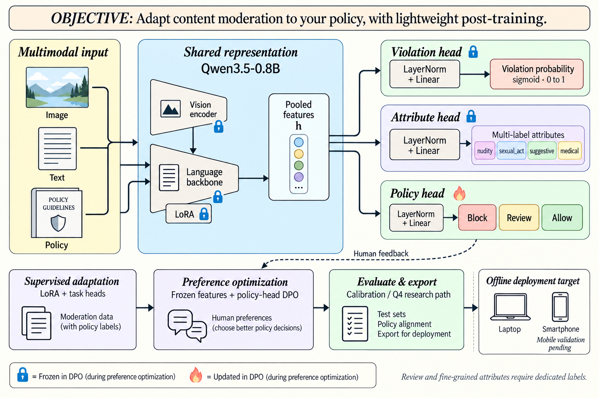
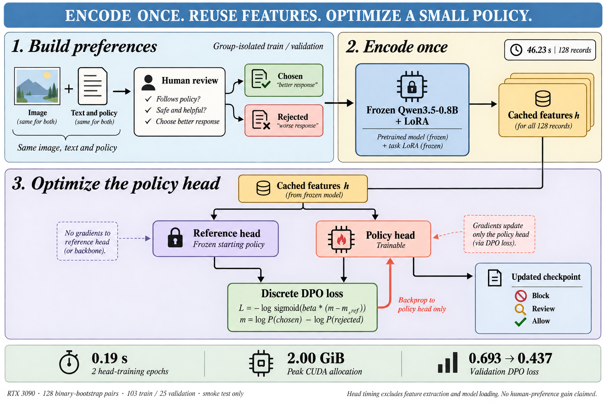

# Jev-PolicyLite

**面向内容审核的轻量多模态决策模型**

[中文](README.md) | [English](README.en.md)

[模型](models/pilot-multihead-v0.1) · [训练指南](docs/TRAINING_GUIDE.md) · [实验记录](docs/EXPERIMENTS.md) · [项目页面源码](site/) · [MIT](LICENSE)

Jev-PolicyLite 基于 Qwen3.5-0.8B，将图片、正文和审核规则作为输入，直接预测违规分数、视觉属性和处置动作。项目借鉴 Jev / NanoJev 从隐藏表征直接评分的思路，将其用于色情与敏感内容审核，并实现了多头训练、人工反馈处理和策略头偏好后训练。

我们关心两个问题：小模型能否结合图文与规则完成审核，以及一次人工纠偏需要多少训练成本。为此，三个审核头复用同一份图文表征；偏好后训练阶段冻结主干，缓存特征，仅更新决定拦截、复审或放行的策略头。

<p align="center">
  
</p>

## 项目内容

- **多头审核模型**：保留 Qwen3.5 的图文编码能力，通过 LoRA 适配审核任务，分别训练违规、属性和处置策略。
- **策略头后训练**：将人工纠偏整理成动作偏好对，在冻结特征上执行离散 DPO，减少重复编码。
- **训练与评测工具**：提供数据校验、按原图分组划分、阈值校准、多头评测和四图拼接压力测试。
- **模型与本地服务**：提供试验版 LoRA 适配器、三个审核头，以及带资源监控的 FastAPI 网页服务。

当前版本已完成训练与部署流程验证。下文分别列出已测结果和仍需验证的能力。

## 方法

### 图文与规则联合审核

模型取最后一个有效 token 的隐藏表征，接三个 `LayerNorm + Linear` 头：

| 审核头 | 输出 | 用途 |
| --- | --- | --- |
| 违规头 | sigmoid 分数 | 判断内容在输入规则下是否违规 |
| 属性头 | 多个 sigmoid 分数 | 预测 `nudity`、`sexual_act`、`suggestive`、`medical` 等可共存属性 |
| 策略头 | 三分类 softmax | 预测 `block`、`review`、`allow` |

监督训练先预热任务头，再训练语言 LoRA 与任务头，视觉编码器保持冻结。属性与处置分开建模，例如“存在裸露”和“医学语境”可以同时成立，最终处置由策略头学习。

Jev / NanoJev 提供了直接评分与决策接口的设计参考。本项目针对固定审核标签采用共享表征多头结构，并增加策略头 DPO；没有实现动态候选集合注意力，也不构成 Jev 的完整复现。

### 策略头偏好后训练

人工复核记录保留同一图片、正文和规则下的两个动作：认可的动作 `chosen` 与被纠正的动作 `rejected`。

训练时冻结主干、LoRA、违规头和属性头，一次性提取图文特征。当前策略头与冻结参考头读取同一份特征，通过离散 DPO 更新动作概率。参考策略只需复制一个小策略头。

<p align="center">
  
</p>

这里的计算节省来自特征复用。它适用于已有表征能够区分样本、但处置需要调整的情况；冻结特征丢失的视觉细节，无法靠更新策略头补回。当前实现是离散动作上的偏好优化，不包含在线 rollout、PPO 或 GRPO。

## 实验结果

### RTX 3090 上的 DPO 流程验证

使用二元标签自动构造 128 对 block/allow 偏好，按原图分组划分为 103 对训练、25 对验证，训练 2 轮。

| 验证指标 | 训练前 | 训练后 |
| --- | ---: | ---: |
| DPO loss | 0.6931 | 0.4371 |
| 偏好排序准确率 | 100.0% | 100.0% |
| chosen/rejected 平均对数概率差 | 6.7104 | 7.9800 |
| 相对参考策略的 KL | 0 | 0.00119 |

128 条图文特征抽取耗时 **46.23 秒**；两轮策略头训练及每轮验证耗时 **0.19 秒**；CUDA 峰值分配量 **2.00 GiB**。计时不包含模型加载与保存，0.19 秒也不包含特征抽取。

这批偏好复述已有二元标签，验证集训练前已经全部排序正确。结果证明流程可运行，尚不能说明真实人工反馈带来的收益，也没有验证复审动作。完整设置见 [DPO 实验记录](docs/DPO_SMOKE_RESULT_V1.md)。

### 四图拼接与端侧试验

| 试验 | 已测结果 | 说明 |
| --- | --- | --- |
| 2×2 拼图，200 张 | 准确率 89.5%，召回率 90.7%，误报率 14.0% | 按“任一格违规则整图违规”评测，不评估逐格定位 |
| 仅一格违规的拼图 | 准确率 84.0% | 用于检查小目标与多图干扰 |
| Linux x86_64，单头 Q4，CPU 4 线程 | 模型目录约 479 MB，峰值 RSS 约 859 MiB | 8 条抽样决策一致，未完成全量回归 |

详细记录：[四图实验](docs/MOSAIC_2X2_RESULT_V1.md)、[端侧进展](docs/EDGE_STATUS.md)。手机端、多头量化和 Windows 端尚未完成实测。

## 快速开始

需要 Python 3.10+、Git LFS、Transformers 5.x。GPU 训练需要匹配 CUDA 的 PyTorch；以下命令使用 Bash。

```bash
git lfs install
git clone https://github.com/fffffiii/jev-policylite.git
cd jev-policylite
git lfs pull

python -m venv .venv
source .venv/bin/activate
pip install -e '.[dev,web]'
```

### 加载试验版模型

[公开模型目录](models/pilot-multihead-v0.1) 包含约 43 MB 的 LoRA 权重、三个审核头、校准文件和元数据。Qwen 基座需另行下载，公开包也未包含 processor；首次使用前，将基座 processor 保存到检查点目录：

```bash
python -c "from transformers import AutoProcessor; AutoProcessor.from_pretrained('Qwen/Qwen3.5-0.8B').save_pretrained('models/pilot-multihead-v0.1/processor')"
```

首次加载基座需要联网或已有本地缓存。准备齐基座、适配器和 processor 后才具备离线加载条件。

```bash
python scripts/predict.py \
  --checkpoint models/pilot-multihead-v0.1 \
  --image path/to/image.jpg \
  --text "image caption" \
  --policy-id strict-v1 \
  --policy-file policies/strict.txt
```

此命令输出二元违规结果。三头输出与服务接口见 [训练指南](docs/TRAINING_GUIDE.md) 和 [模型说明](models/pilot-multihead-v0.1/README.md)。

### 监督训练

按 [数据格式](data/README.md) 准备自己的 JSONL 清单，在 `configs/train.yaml` 中设置数据路径与训练参数：

```bash
python scripts/validate_data.py --manifest data/manifest.jsonl --image-root .
python scripts/train.py --config configs/train.yaml
```

多头配置参考 `configs/public-pilot-multihead.yaml`。属性头和策略头需要对应标签；仅将二元标签映射成 block/allow 不会教会模型复审。完整步骤见 [训练指南](docs/TRAINING_GUIDE.md)。

### 用人工反馈更新策略

完成上述模型准备后，将复核记录写入 `data/review_feedback.jsonl`：

```bash
python scripts/build_preference_pairs.py \
  --feedback data/review_feedback.jsonl \
  --output outputs/preferences/review_pairs.jsonl \
  --strict

python scripts/train_policy_dpo.py \
  --checkpoint models/pilot-multihead-v0.1 \
  --preferences outputs/preferences/review_pairs.jsonl \
  --output-dir outputs/policy-dpo \
  --epochs 3 --beta 0.5
```

训练器按原图组隔离训练与验证数据，拒绝覆盖已有输出目录。输出包含适配器、processor、各任务头和 `dpo_metrics.json`，加载时仍需要基座模型。偏好格式与参数见 [后训练指南](docs/HUMAN_FEEDBACK_AND_RL.md)。

### 本地服务

```bash
MODEL_CHECKPOINT=models/pilot-multihead-v0.1 \
CALIBRATION_FILE=models/pilot-multihead-v0.1/calibration.json \
python -m uvicorn qwen35_moderation.web.app:app \
  --host 0.0.0.0 --port 8089 --workers 1
```

浏览器访问 `http://localhost:8089`，可提交图片与正文、查看审核结果和运行状态。

## 已知限制

- 试训属性标签来自内容等级映射，缺少充分的医学语境和真实复审标注；目前结果不能证明这些细分类别可靠。
- 输入支持审核规则，但还需要去除规则、替换规则和未见规则测试，确认模型是否真正使用政策语义。
- 小样本实验不能建立低误报保证。正式评估应在独立测试集上报告固定误报率下的召回，并按内容类型分组。
- 当前尚未完成与纯视觉分类器、同基座 Yes/No 评分的同条件对照，不能据此宣称决策头提升了精度或端到端速度。

## 文档与贡献

| 内容 | 入口 |
| --- | --- |
| 数据格式与标注 | [data/README.md](data/README.md) |
| 监督训练、校准与评测 | [训练指南](docs/TRAINING_GUIDE.md) |
| 人工反馈与离散 DPO | [后训练指南](docs/HUMAN_FEEDBACK_AND_RL.md) |
| 多头与四图压力测试 | [实验工具](docs/EXPERIMENTS.md) |
| 静态项目页部署 | [GitHub Pages](docs/GITHUB_PAGES.md) |

欢迎提交代码、复现结果和错误分析。提交前运行 `python -m pytest -q`；审核相关改动请说明使用的政策、标签与数据划分。详细要求见 [贡献说明](CONTRIBUTING.md)。真实审核图片、人工反馈和私有日志不随仓库发布。

## 许可与致谢

项目代码采用 [MIT](LICENSE) 协议。基座模型、数据和第三方依赖遵循各自许可。

感谢 Qwen 提供图文基座，以及 Jev / NanoJev 的直接决策设计思路。Jev-PolicyLite 为独立项目。
